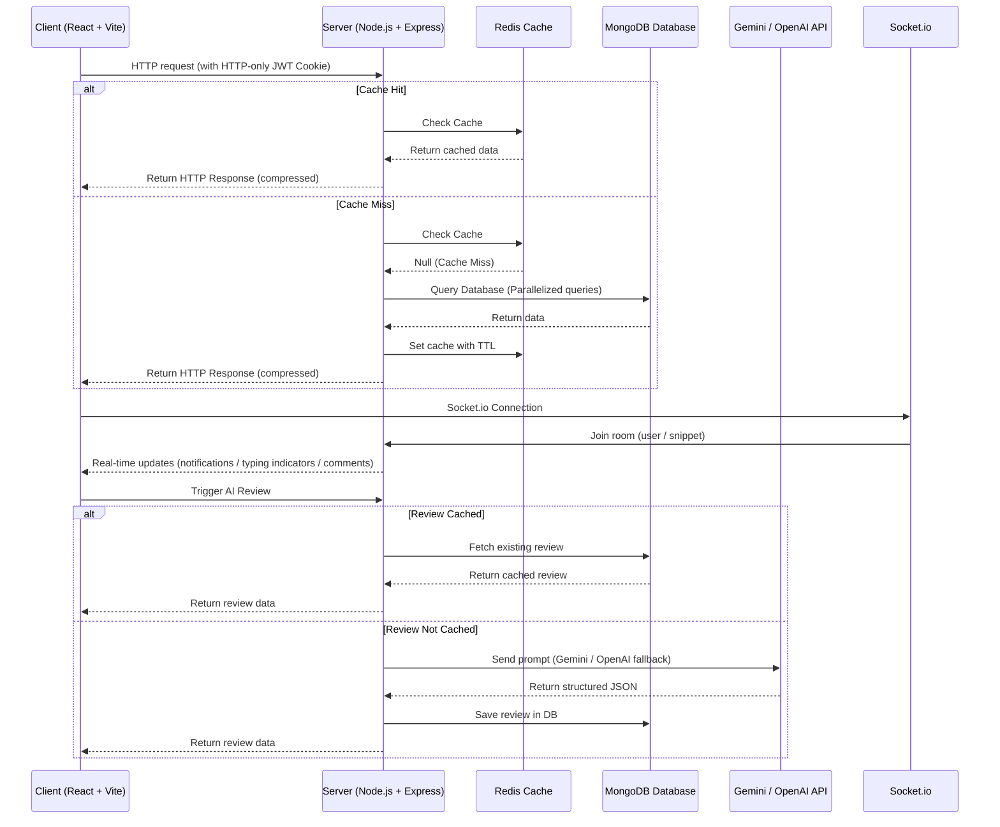

<h1 align="center">
  🖥️ DevCollab — Frontend
</h1>

<h4 align="center">The React frontend for DevCollab — a collaborative platform for developers to share, review, and improve code snippets in real time.</h4>

<p align="center">
  
  
  
  
  
</p>

<p align="center">
  <a href="#-features">Features</a> •
  <a href="#-lighthouse-scores">Lighthouse Scores</a> •
  <a href="#-optimization-techniques">Optimization Techniques</a> •
  <a href="#-system-architecture">System Architecture</a> •
  <a href="#-tech-stack">Tech Stack</a> •
  <a href="#️-project-structure">Project Structure</a> •
  <a href="#-getting-started">Getting Started</a> •
  <a href="#-environment-variables">Environment Variables</a> •
  <a href="#-pages--routing">Pages & Routing</a> •
  <a href="#-deployment">Deployment</a>
</p>

---

## ✨ Features

- 🔐 **Auth UI** — Login & Register forms with local, Google, and GitHub OAuth support.
- 🏠 **Home Feed** — Browse all community snippets sorted by net votes; filter by language, tag, or search.
- 📝 **Create Snippet** — Rich form to post code with title, description, language, and tags (supports multiple languages).
- 🔍 **Snippet Detail** — Full code view with syntax highlighting (Monaco Editor), comments, voting, and AI review panel.
- 💬 **Real-time Collaboration** — Live typing indicators and instant comment synchronization using Socket.IO.
- 👍 **Voting** — Toggle upvote/downvote on snippets and individual comments (mutually exclusive).
- 🤖 **AI Code Review** — Request an AI-generated review (summary, bugs, suggestions, complexity) powered by Gemini (with OpenAI fallback).
- 👤 **User Profiles** — View public profiles, bio, avatar, reputation points, activity heatmaps, and posted snippets.
- 🔄 **OAuth Profile Completion** — Guided username-selection flow for new OAuth users to prevent account creation loops.
- 🔒 **Route Guards** — Protected routes redirect unauthenticated users; incomplete profiles are directed to the username setup.

---

## 📊 Lighthouse Scores

The client application is optimized for speed, accessibility, best practices, and SEO, achieving stellar audit results:

| Metric | Score | Status |
| :--- | :---: | :--- |
| **Performance** | `99` | 🚀 Lightning Fast Page Loads |
| **Accessibility** | `95` | ♿ WCAG AA Compliant |
| **Best Practices** | `100` | ✅ Flawless Architecture |
| **SEO** | `100` | 🔍 Fully Crawlable & Optimized |

---

## ⚡ Optimization Techniques

To achieve peak performance and accessibility, the following techniques were implemented:

* **Selective Client-Side Lazy Loading**: Code-splitted heavy page routes (`SnippetDetail`, `Profile`, `CreateSnippet`, `CompleteProfile`) using `React.lazy()` and `Suspense`. Frequently visited pages (`Home`, `Login`, `Register`) remain statically imported. This reduced the initial JS bundle size from **406 kB to 350 kB** (a 14% reduction).
* **Lightweight Suspense Fallbacks**: Replaced flashy animated page loaders with lightweight, non-shifting CSS spinners/skeletons, preventing Cumulative Layout Shift (CLS).
* **Silent Auth Verification**: Configured the auth initialization to check for local token presence before making the `/auth/me` session validation request. This silences the expected `401 Unauthorized` network and console errors for guest users.
* **WCAG AA Color Contrast**: Optimized grey color variables (`--text-secondary` and `--text-muted`) for both light and dark modes to meet AAA/AA contrast guidelines.
* **Semantic Landmark Elements**: Wrapped page routing nodes inside a semantic `<main>` landmark for accessibility screen readers.
* **Heading Ordering Rules**: Re-structured heading hierarchies on lists and detail pages to progress logically without level-skipping.
* **SEO Crawlability**: Configured meaningful meta titles, descriptive meta tags, and added `robots.txt` / `sitemap.xml` to support search engine crawlers.

---

## 📐 System Architecture

Below is the high-level architecture diagram detailing the client-server interaction, caching strategy, real-time sync, and AI review flows:



---

## 🛠 Tech Stack

| Technology | Version | Purpose |
|---|---|---|
| **React** | 19 | UI framework |
| **React Router DOM** | 7 | Client-side routing & navigation |
| **Vite** | 8 | Build tool & HMR dev server |
| **Socket.io Client** | 4 | Real-time WebSocket connection to the backend |
| **Axios** | 1.x | HTTP client for REST API calls |
| **Vanilla CSS** | — | Custom styling & design tokens |

---

## 🗂️ Project Structure

```
devcollab-client/
├── public/                    # Static public assets (robots.txt, sitemap.xml)
├── src/
│   ├── api/                   # Axios instance & API helper functions
│   ├── assets/                # Static assets (images, logos)
│   ├── components/
│   │   ├── Navbar.jsx         # Top navigation bar
│   │   ├── SnippetCard.jsx    # Snippet preview card
│   │   ├── ActivityHeatmap.jsx# Activity heatmap component
│   │   └── CommandPalette.jsx # Command search palette
│   ├── context/
│   │   └── AuthContext.jsx    # Global auth state provider
│   ├── pages/
│   │   ├── Home.jsx           # Community feed with search
│   │   ├── Login.jsx          # Login page
│   │   ├── Register.jsx       # Registration page
│   │   ├── SnippetDetail.jsx  # Full snippet view & AI reviews
│   │   ├── CreateSnippet.jsx  # Snippet creation form
│   │   ├── CompleteProfile.jsx# OAuth profile completion
│   │   └── Profile.jsx        # Public user profile page
│   ├── App.jsx                # Root router config
│   ├── App.css                # Layout styles
│   ├── index.css              # Typography & CSS tokens
│   └── main.jsx               # React entry point
├── index.html                 # HTML shell
├── vite.config.js             # Vite config
├── eslint.config.js           # Linting config
└── package.json
```

---

## 🚀 Getting Started

### Prerequisites
- **Node.js** v18 or higher
- **npm** v8 or higher
- The [DevCollab backend](https://github.com/Punitzn/devcollab-server) running locally or deployed

### Installation

```bash
# 1. Clone the repository
git clone https://github.com/Punitzn/devcollab-client.git
cd devcollab-client

# 2. Install dependencies
npm install

# 3. Create your environment file
cp .env.local.example .env.local
# Then edit .env.local with your backend URL

# 4. Start the development server
npm run dev
```

The app will be available at **http://localhost:5173**.

### Available Scripts

| Command | Description |
|---|---|
| `npm run dev` | Start Vite dev server |
| `npm run build` | Build for production into `dist/` |
| `npm run preview` | Locally preview the production build |
| `npm run lint` | Run ESLint check |

---

## 🔑 Environment Variables

Create a `.env.local` file in the root of this directory:

```env
# Base URL of the DevCollab backend API
VITE_API_URL=http://localhost:8000
```

> All Vite environment variables must be prefixed with `VITE_` to be accessible in the browser.

---

## 📄 Pages & Routing

| Route | Page | Auth Required | Description |
|---|---|---|---|
| `/` | `Home.jsx` | ❌ (public) | Community snippet feed |
| `/login` | `Login.jsx` | ❌ | Login with email or OAuth |
| `/register` | `Register.jsx` | ❌ | Create a new account |
| `/snippets/:id` | `SnippetDetail.jsx` | ❌ | View snippet, comments & AI reviews |
| `/profile/:id` | `Profile.jsx` | ❌ | View user profile page |
| `/create` | `CreateSnippet.jsx` | ✅ | Create a new snippet |
| `/complete-profile` | `CompleteProfile.jsx` | ✅ (OAuth) | Set username after OAuth sign-in |

### Route Guards

- **`RequireAuth`** — Redirects to `/login` if user session is absent.
- **`RequireCompleteProfile`** — Redirects OAuth users to `/complete-profile` if their profile is incomplete.

---

## 🔌 Real-time (Socket.io)

The app connects to the backend Socket.io server to relay live comments and presence data:
- **Instant Comments** — Comments appear live for all viewers of a snippet.
- **Typing Indicators** — Displays a list of users currently composing reviews on a snippet.

---

## 🌐 Deployment

This frontend is configured for deployment on platforms like **Vercel**. The root `vercel.json` rewrite configuration handles spa-routing:

```json
{
  "buildCommand": "cd devcollab-client && npm install && npm run build",
  "outputDirectory": "devcollab-client/dist",
  "rewrites": [{ "source": "/(.*)", "destination": "/index.html" }]
}
```

---

## 🔗 Related

- **Backend Repository** — [devcollab-server](https://github.com/Punitzn/devcollab-server)

---

## 📄 License

This project is open source and available under the [MIT License](LICENSE).

<p align="center">Built with ❤️ using React + Vite</p>
